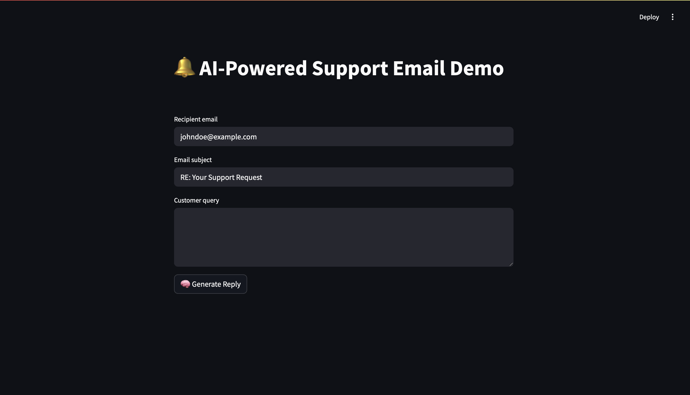

# 🧠 AI-Powered Support Email Demo

This is a simple web app that uses **Azure OpenAI** to generate customer support replies and sends them via **Azure Communication Services Email** — all through an interactive UI built with **Streamlit**.

> Perfect for demos, testing, or building your own AI support assistant!

---

## 🚀 Features

- ✨ AI-generated support replies using GPT (via Azure OpenAI)
- 📝 Editable response before sending
- 📤 Sends email to customer using Azure Communication Services
- ⚡ Clean, simple Streamlit UI

---

## 📸 Demo Preview

 <!-- Optional: replace with your own screenshot -->

---

## 🧱 Tech Stack

- [Streamlit](https://streamlit.io/) – UI framework
- [Azure OpenAI](https://learn.microsoft.com/en-us/azure/cognitive-services/openai/) – for generating replies
- [Azure Communication Services Email](https://learn.microsoft.com/en-us/azure/communication-services/quickstarts/email/send-email) – for sending emails
- [python-dotenv](https://pypi.org/project/python-dotenv/) – to manage environment variables

---

## 🛠 Setup

### 1. Clone this repo

```bash
git clone https://github.com/your-username/ai-support-email-demo.git
cd ai-support-email-demo
```

### 2. Install dependencies
```bash
pip install -r requirements.txt
```

### 3. Create a .env file
```bash
OPENAI_API_KEY=your_azure_openai_key
OPENAI_ENDPOINT=https://your-openai-resource.openai.azure.com/
ACS_CONNECTION_STRING=endpoint=https://your-resource.communication.azure.com/;accesskey=your_key
ACS_SENDER_EMAIL=DoNotReply@your-resource.communication.azure.com
RECIPIENT_EMAIL=someone@example.com
```

### 4. Run the app
```bash
streamlit run app.py
```

### Example Flow

Type a customer query (e.g. “I forgot my password”)
Click 🧠 Generate Reply
Edit the reply if needed
Click 📤 Send Email
Done! Email gets delivered to the customer inbox

📄 License

MIT License. Free to use, modify, and share.

👨‍💻 Author

Made with ❤️ by Farhan Hussain

